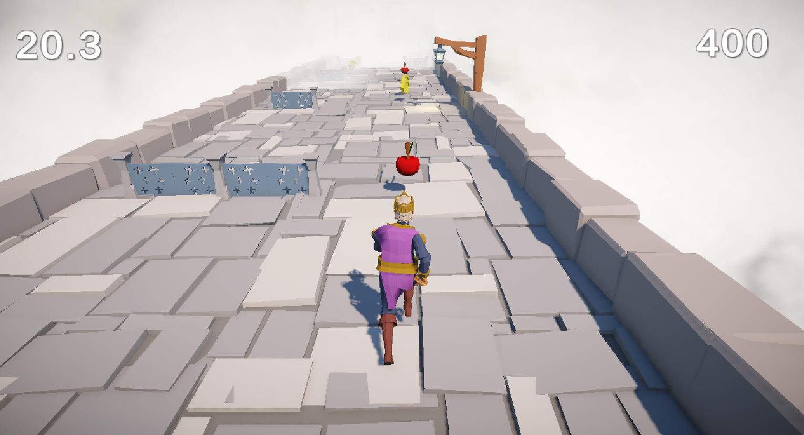

# 👑 King's Endless Runner

An epic endless runner game where a brave king sprints through an ancient fort, collecting apples and coins while dodging deadly traps to stay alive!

---
## 🌐 Play The Game

👉 [Play on Unity Play](https://play.unity.com/en/games/3258a30f-3da3-40d7-b336-70377f33a993/royal-runner)  
> No install required. Just hit play and run for your life! 🏃‍♂️👑)
👉 [Game Play ](https://youtu.be/nSoU05PDzgk)  


---


## 🎮 Gameplay Overview

You play as a king running endlessly across a floating fort path in the sky.  
Your mission is to survive as long as possible by:

- 🪙 Collecting coins to increase your score
- 🍎 Grabbing apples to speed run 
- 🧱 Dodging traps and obstacles that try to stop you

The game gradually increases in difficulty, keeping you on your toes!

---

## 📸 Screenshots

  
> A glimpse of the royal race for survival!


---

## 🛠 Built With

- **Unity Engine** (URP)
- **C#** for scripting
- **TextMeshPro** for stylish UI
- **Blender/Sketchfab** assets for characters and environment
- **WebGL Build** for browser gameplay

---


## 📂 How to Run Locally

1. Clone the repo:

```bash
git clone https://github.com/your-username/king-endless-runner.git
